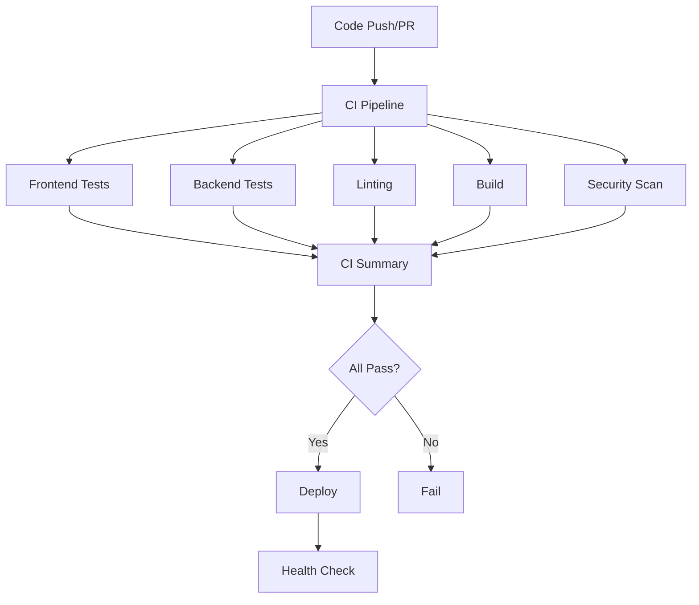

# CI/CD Pipeline Documentation

## Overview

Comprehensive GitHub Actions CI/CD pipeline with multiple independent workflows for testing, building, security scanning, deployment, and automated releases.

## 🚀 Pipeline Architecture

The CI/CD system consists of **13 independent workflows** that can run individually or as part of the main CI pipeline.

### Key Features
- ✅ Automated semantic versioning
- ✅ Conventional commit validation
- ✅ Automated changelog generation
- ✅ GitHub releases on every main push
- ✅ Multi-environment deployment
- ✅ Complete test coverage

### Workflow Overview



## 📋 Individual Workflows

### 1. Frontend Tests (`frontend-tests.yml`)

**Purpose**: Test frontend components, hooks, and services

**Triggers:**
- Push to main, develop, or feature branches (when frontend files change)
- Pull requests
- Manual dispatch

**Jobs:**
- **Test**: Run Vitest unit and component tests
  - Matrix: Node.js 16.x, 18.x, 20.x
  - Coverage reporting
  - Artifact uploads
- **Test Results**: Publish test results and coverage

**Features:**
- ✅ Multi-version Node.js testing
- ✅ Coverage upload to Codecov
- ✅ PR comment with coverage report
- ✅ Artifact retention (30 days)
- ✅ Dependency caching

**Duration**: ~5-10 minutes

### 2. Backend Tests (`backend-tests.yml`)

**Purpose**: Test backend controllers, middleware, and routes

**Triggers:**
- Push to main, develop, or feature branches (when backend files change)
- Pull requests
- Manual dispatch

**Jobs:**
- **Test**: Run Jest unit and integration tests
  - Matrix: Node.js 16.x, 18.x, 20.x
  - MySQL 8.0 service container
  - Coverage thresholds (70%)
- **Lint**: ESLint checking
- **Type Check**: TypeScript compilation
- **Security**: npm audit and Snyk scan

**Features:**
- ✅ MySQL test database
- ✅ Coverage thresholds enforced
- ✅ Multiple Node versions
- ✅ CodeQL integration
- ✅ Separate linting job

**Duration**: ~10-15 minutes

### 3. E2E Tests (`e2e-tests.yml`)

**Purpose**: End-to-end testing with Playwright

**Triggers:**
- Push to main or develop
- Pull requests
- Weekly schedule (Sunday)
- Manual dispatch

**Jobs:**
- **E2E Tests**: Playwright tests across browsers
  - Matrix: Chromium, Firefox, WebKit
  - Sharded execution (4 shards per browser)
  - Full app testing
- **Accessibility Tests**: a11y validation

**Features:**
- ✅ Multi-browser testing
- ✅ Test sharding for parallelization
- ✅ Screenshot capture on failure
- ✅ Playwright report uploads
- ✅ Accessibility checks
- ✅ Full stack integration

**Duration**: ~15-30 minutes

### 4. Linting (`linting.yml`)

**Purpose**: Code quality and formatting checks

**Triggers:**
- Push to any branch
- Pull requests
- Manual dispatch

**Jobs:**
- **Frontend Lint**: ESLint for frontend
- **Backend Lint**: ESLint for backend
- **Prettier Check**: Code formatting validation
- **TypeScript Check**: Type validation
- **Code Quality Summary**: Overall status

**Features:**
- ✅ Separate frontend/backend linting
- ✅ Prettier formatting checks
- ✅ TypeScript strict checking
- ✅ Code annotations on PRs
- ✅ Quality gates

**Duration**: ~5-10 minutes

### 5. Build (`build.yml`)

**Purpose**: Verify builds work across environments

**Triggers:**
- Push to any branch
- Pull requests
- Manual dispatch

**Jobs:**
- **Build Frontend**: Vite production build
  - Matrix: Node.js 18.x, 20.x
  - Bundle analysis
  - Artifact uploads
- **Build Backend**: TypeScript compilation
  - Matrix: Node.js 18.x, 20.x
  - Dist verification
- **Build Summary**: Overall build status

**Features:**
- ✅ Multi-version builds
- ✅ Bundle size analysis
- ✅ Source map detection
- ✅ Production readiness check
- ✅ Build artifact retention

**Duration**: ~10-15 minutes

### 6. Security (`security.yml`)

**Purpose**: Security vulnerability scanning

**Triggers:**
- Push to main or develop
- Pull requests
- Weekly schedule (Monday)
- Manual dispatch

**Jobs:**
- **Dependency Scan**: npm audit for vulnerabilities
  - Frontend and backend separately
  - Critical/high severity detection
- **Snyk Scan**: Advanced vulnerability detection
- **CodeQL Analysis**: Code security analysis
- **Secret Scan**: TruffleHog secret detection
- **License Check**: License compliance
- **Security Summary**: Overall security status

**Features:**
- ✅ Multiple security tools
- ✅ Dependency vulnerability checking
- ✅ Secret detection
- ✅ License compliance
- ✅ CodeQL GitHub integration
- ✅ Automated issue creation

**Duration**: ~15-30 minutes

### 7. CI Pipeline (`ci.yml`)

**Purpose**: Main CI orchestrator

**Triggers:**
- Push to main or develop
- Pull requests
- Manual dispatch

**Jobs:**
- Calls all individual workflows
- Creates comprehensive summary
- Posts PR comments with results
- Enforces quality gates

**Features:**
- ✅ Orchestrates all checks
- ✅ Parallel execution
- ✅ Summary reporting
- ✅ PR status comments
- ✅ Quality gates

**Duration**: ~20-40 minutes (parallel execution)

### 8. Deploy (`deploy.yml`)

**Purpose**: Automated deployment to environments

**Triggers:**
- Push to main branch
- Version tags (v*)
- Manual dispatch (with environment selection)

**Jobs:**
- **Prepare**: Determine environment and version
- **Build Frontend**: Production build
- **Build Backend**: Production build
- **Deploy Frontend**: Deploy to hosting (Vercel/Netlify/GitHub Pages)
- **Deploy Backend**: Deploy to server (Heroku/Railway/SSH)
- **Post Deploy**: Health checks and notifications
- **Rollback**: Auto-rollback on failure

**Features:**
- ✅ Multi-environment support
- ✅ Multiple deployment targets
- ✅ Health checks
- ✅ Rollback capability
- ✅ Release notes creation
- ✅ Slack notifications

**Duration**: ~15-25 minutes

### 9. PR Validation (`pr-validation.yml`)

**Purpose**: Validate pull requests

**Triggers:**
- Pull request events

**Jobs:**
- **Validate PR**: Check title, size, labels
- **Conflict Check**: Detect merge conflicts
- **Required Checks**: Verify all validations pass

**Features:**
- ✅ Semantic PR title validation
- ✅ PR size warnings
- ✅ Breaking change detection
- ✅ Auto-labeling
- ✅ Conflict detection

**Duration**: ~2-5 minutes

### 10. Dependency Updates (`dependency-update.yml`)

**Purpose**: Monitor dependency updates

**Triggers:**
- Weekly schedule (Monday)
- Manual dispatch

**Jobs:**
- **Update Dependencies**: Check for outdated packages
  - Frontend and backend
  - Create issues for updates

**Features:**
- ✅ Weekly automated checks
- ✅ Issue creation for updates
- ✅ Separate frontend/backend
- ✅ Outdated package reports

**Duration**: ~5-10 minutes

### 11. Performance Testing (`performance.yml`)

**Purpose**: Performance and bundle size monitoring

**Triggers:**
- Pull requests
- Manual dispatch

**Jobs:**
- **Lighthouse**: Performance audit
- **Bundle Size**: Bundle analysis
- **API Performance**: Load testing with k6

**Features:**
- ✅ Lighthouse CI integration
- ✅ Bundle size limits
- ✅ API load testing
- ✅ Performance regression detection
- ✅ PR comments with metrics

**Duration**: ~15-20 minutes

## 🎯 Workflow Matrix

| Workflow | Frontend | Backend | E2E | Security | Deploy |
|----------|----------|---------|-----|----------|--------|
| Frontend Tests | ✅ | - | - | - | - |
| Backend Tests | - | ✅ | - | - | - |
| E2E Tests | ✅ | ✅ | ✅ | - | - |
| Linting | ✅ | ✅ | - | - | - |
| Build | ✅ | ✅ | - | - | - |
| Security | ✅ | ✅ | - | ✅ | - |
| CI | ✅ | ✅ | - | ✅ | - |
| Deploy | ✅ | ✅ | - | - | ✅ |
| PR Validation | ✅ | ✅ | - | - | - |
| Dependencies | ✅ | ✅ | - | - | - |
| Performance | ✅ | ✅ | - | - | - |

## ⚙️ Configuration

### Required Secrets

#### Deployment Secrets (Optional)
```
# Frontend Deployment
VERCEL_TOKEN
NETLIFY_AUTH_TOKEN
NETLIFY_SITE_ID

# Backend Deployment
HEROKU_API_KEY
HEROKU_APP_NAME
HEROKU_EMAIL
RAILWAY_TOKEN
SSH_HOST
SSH_USERNAME
SSH_PRIVATE_KEY
SSH_PORT

# Application Secrets
API_URL
BACKEND_URL
FRONTEND_URL
JWT_SECRET
DB_HOST
DB_USER
DB_PASSWORD
DB_NAME
```

#### Monitoring & Notifications (Optional)
```
SNYK_TOKEN          # Snyk security scanning
SLACK_WEBHOOK       # Slack notifications
CODECOV_TOKEN       # Codecov integration
```

### Environment Variables

Each workflow uses appropriate environment variables:

**Testing:**
- `CI=true`
- `NODE_ENV=test`
- Test database credentials

**Building:**
- `NODE_ENV=production`
- API URLs for frontend

**Deployment:**
- All production secrets
- Environment-specific config

## 🔄 Workflow Execution Flow

### On Push to Feature Branch

```
1. Frontend Tests (if frontend changed)
2. Backend Tests (if backend changed)
3. Linting (always)
4. Build (always)
```

### On Pull Request

```
1. PR Validation (title, size, conflicts)
2. CI Pipeline
   ├─ Frontend Tests
   ├─ Backend Tests
   ├─ E2E Tests
   ├─ Linting
   ├─ Build
   └─ Security Scan
3. Performance Tests
4. PR Comment with results
```

### On Push to Main

```
1. Full CI Pipeline
2. E2E Tests
3. Security Scan
4. Deploy to Staging
5. Health Checks
6. (Manual) Deploy to Production
```

### On Version Tag (v*)

```
1. Full CI Pipeline
2. Build for Production
3. Deploy to Production
4. Create GitHub Release
5. Health Checks
6. Notifications
```

## 📊 Caching Strategy

### NPM Dependencies
```yaml
- uses: actions/cache@v3
  with:
    path: node_modules
    key: ${{ runner.os }}-node-${{ hashFiles('package-lock.json') }}
```

### Build Artifacts
- Frontend build: 7 days retention
- Backend build: 7 days retention
- Test results: 30 days retention
- Coverage reports: 30 days retention

## 🎯 Quality Gates

### Required for Merge
- ✅ All tests passing (frontend + backend)
- ✅ Linting passing
- ✅ TypeScript checks passing
- ✅ Build successful
- ✅ No merge conflicts
- ✅ Valid PR title

### Warning Thresholds (Non-blocking)
- ⚠️ Security vulnerabilities (moderate)
- ⚠️ Bundle size > 5MB
- ⚠️ PR size > 100 files
- ⚠️ Prettier formatting issues

### Blocking Thresholds
- ❌ Critical security vulnerabilities
- ❌ Test coverage < 70% (backend)
- ❌ TypeScript errors
- ❌ ESLint errors
- ❌ Build failures

## 🔐 Security Scanning

### Tools Used
1. **npm audit**: Built-in dependency scanning
2. **Snyk**: Advanced vulnerability detection
3. **CodeQL**: GitHub's semantic code analysis
4. **TruffleHog**: Secret detection
5. **License Checker**: License compliance

### Scan Frequency
- **On every PR**: npm audit, CodeQL
- **Weekly**: Full security scan including Snyk
- **On push to main**: Complete security suite

## 🚀 Deployment Strategy

### Environments

**Staging:**
- Triggers: Push to develop or main
- Auto-deploy: Yes
- Approval: Not required

**Production:**
- Triggers: Version tags (v*) or manual
- Auto-deploy: Optional
- Approval: Required (GitHub environment protection)

### Deployment Targets

**Frontend Options:**
1. **Vercel** (Recommended)
   - Automatic preview deployments
   - Edge network
   - Easy rollback

2. **Netlify**
   - Form handling
   - Serverless functions
   - Split testing

3. **GitHub Pages**
   - Free hosting
   - Custom domain support
   - Simple setup

**Backend Options:**
1. **Heroku**
   - Easy setup
   - Add-ons available
   - Auto-scaling

2. **Railway**
   - Modern platform
   - Great DX
   - Automatic SSL

3. **SSH Deployment**
   - VPS/dedicated server
   - Full control
   - PM2 process management

### Rollback Strategy

**Automatic Rollback:**
- Health check failures after deployment
- Critical errors in post-deploy tests

**Manual Rollback:**
```bash
# Revert to previous version
git revert <commit-hash>
git push origin main

# Or use GitHub UI
# Deployments → Select previous → Redeploy
```

## 📈 Performance Monitoring

### Lighthouse CI
- Performance score
- Accessibility score
- Best practices score
- SEO score

**Thresholds:**
- Performance: > 90
- Accessibility: > 95
- Best Practices: > 90
- SEO: > 90

### Bundle Size Monitoring
- Total bundle size limit: 5MB
- Individual chunk limits
- Code splitting verification
- Tree-shaking validation

### API Load Testing (k6)
- Concurrent users: Up to 50
- Duration: 2 minutes
- Thresholds:
  - P95 response time < 500ms
  - Error rate < 10%

## 🔔 Notifications

### Slack Integration (Optional)
```yaml
- Deployment success/failure
- Security vulnerabilities
- Test failures
- Build failures
```

### GitHub Notifications
- PR comments with test results
- PR comments with coverage
- PR comments with bundle size
- Issues created for failures

## 🛠️ Running Workflows Manually

### Via GitHub UI
1. Go to Actions tab
2. Select workflow
3. Click "Run workflow"
4. Choose branch and options

### Via GitHub CLI
```bash
# Trigger CI pipeline
gh workflow run ci.yml

# Trigger specific workflow
gh workflow run frontend-tests.yml

# Trigger deployment
gh workflow run deploy.yml -f environment=staging

# View workflow runs
gh run list --workflow=ci.yml

# View specific run
gh run view <run-id>

# Download artifacts
gh run download <run-id>
```

## 📝 Workflow File Locations

```
.github/workflows/
├── ci.yml                    # Main CI orchestrator
├── frontend-tests.yml        # Frontend testing
├── backend-tests.yml         # Backend testing
├── e2e-tests.yml            # E2E testing
├── linting.yml              # Code quality
├── build.yml                # Build verification
├── security.yml             # Security scanning
├── deploy.yml               # Deployment
├── pr-validation.yml        # PR validation
├── dependency-update.yml    # Dependency monitoring
└── performance.yml          # Performance testing
```

## 🎯 Optimization Strategies

### Parallel Execution
- All test workflows run in parallel
- Matrix jobs run concurrently
- Independent workflows don't block each other

### Caching
- npm dependencies cached
- Build outputs cached
- Playwright browsers cached

### Conditional Execution
- Path filters for frontend/backend
- Skip unchanged workspaces
- Fast-fail strategies

### Resource Management
- Timeout limits on all jobs
- Artifact cleanup (7-30 days)
- Concurrent job limits

## 📊 Workflow Statistics

| Workflow | Jobs | Matrix | Avg Duration | Artifacts |
|----------|------|--------|--------------|-----------|
| Frontend Tests | 2 | 3 | 8 min | Coverage, Results |
| Backend Tests | 4 | 3 | 12 min | Coverage, Results |
| E2E Tests | 2 | 12 | 25 min | Reports, Screenshots |
| Linting | 4 | - | 7 min | Reports |
| Build | 3 | 2 | 10 min | Build output |
| Security | 5 | - | 20 min | Scan results |
| Deploy | 6 | - | 18 min | Builds |
| PR Validation | 3 | - | 3 min | - |
| Dependencies | 1 | 2 | 8 min | Reports |
| Performance | 3 | - | 15 min | Lighthouse |

**Total**: 11 workflows, 33 jobs, ~100+ matrix variations

## 🐛 Troubleshooting

### Workflow Fails

**Check logs:**
```bash
gh run view <run-id> --log-failed
```

**Common Issues:**

1. **Tests Timeout**
   - Increase timeout in workflow
   - Check for hanging promises
   - Verify test cleanup

2. **Build Fails**
   - Check dependency versions
   - Verify environment variables
   - Review error logs

3. **Deployment Fails**
   - Verify secrets configured
   - Check deployment target status
   - Review health check logs

4. **Cache Issues**
   - Clear cache manually
   - Update cache key
   - Disable cache temporarily

### Re-running Failed Jobs

```bash
# Re-run failed jobs only
gh run rerun <run-id> --failed

# Re-run entire workflow
gh run rerun <run-id>
```

## 🔧 Customization

### Adding New Workflows

1. Create workflow file in `.github/workflows/`
2. Define triggers and jobs
3. Add to CI pipeline if needed
4. Update documentation

### Modifying Existing Workflows

1. Edit workflow YAML
2. Test with workflow_dispatch
3. Verify on feature branch
4. Update documentation

### Environment-Specific Config

Use GitHub Environments for:
- Deployment approvals
- Environment secrets
- Protection rules

## 📚 Best Practices

### Workflow Design
- ✅ Keep workflows focused and single-purpose
- ✅ Use matrix for multi-version testing
- ✅ Implement proper timeout limits
- ✅ Add continue-on-error where appropriate
- ✅ Upload artifacts for debugging

### Security
- ✅ Use secrets for sensitive data
- ✅ Limit token permissions
- ✅ Scan dependencies regularly
- ✅ Validate all inputs
- ✅ Use trusted actions only

### Performance
- ✅ Cache dependencies
- ✅ Run jobs in parallel
- ✅ Use path filters
- ✅ Implement fast-fail where appropriate
- ✅ Optimize build steps

### Maintenance
- ✅ Keep actions up to date
- ✅ Monitor workflow duration
- ✅ Clean up old artifacts
- ✅ Review and update regularly
- ✅ Document changes

## 📖 Additional Resources

### GitHub Actions Documentation
- [Workflow syntax](https://docs.github.com/en/actions/reference/workflow-syntax-for-github-actions)
- [Events that trigger workflows](https://docs.github.com/en/actions/reference/events-that-trigger-workflows)
- [Contexts](https://docs.github.com/en/actions/reference/context-and-expression-syntax-for-github-actions)

### Third-Party Actions
- [Codecov](https://github.com/codecov/codecov-action)
- [Snyk](https://github.com/snyk/actions)
- [Lighthouse CI](https://github.com/treosh/lighthouse-ci-action)

### Monitoring Tools
- GitHub Actions dashboard
- Codecov dashboard
- Dependabot alerts

## ✅ Verification Checklist

Before enabling in production:

- [ ] All secrets configured
- [ ] Environments set up (staging, production)
- [ ] Branch protection rules enabled
- [ ] Required status checks configured
- [ ] Deployment targets tested
- [ ] Notifications configured
- [ ] Team access reviewed
- [ ] Documentation updated

## 🎉 Benefits

### Developer Experience
- ✅ Fast feedback on code changes
- ✅ Automated quality checks
- ✅ Consistent testing across environments
- ✅ Clear failure messages

### Code Quality
- ✅ Enforced code standards
- ✅ Automated testing
- ✅ Coverage monitoring
- ✅ Type safety verification

### Security
- ✅ Automated vulnerability scanning
- ✅ Secret detection
- ✅ License compliance
- ✅ Code analysis

### Deployment
- ✅ Automated deployments
- ✅ Zero-downtime deploys
- ✅ Rollback capability
- ✅ Health monitoring

---

**Total Workflows**: 11  
**Total Jobs**: 33  
**Coverage**: Complete CI/CD pipeline  
**Status**: Production-ready  
**Last Updated**: February 9, 2026
