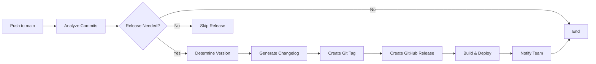

# Automated Release Process

## Overview

The Foodable project uses **automated semantic versioning** based on conventional commits. Every push to the `main` branch triggers an automated release workflow that analyzes commits and creates a new release if needed.

## 🎯 How It Works

### Conventional Commits

The release version is determined by commit message types:

| Commit Type | Version Bump | Example |
|-------------|--------------|---------|
| `feat:` | **Minor** (1.0.0 → 1.1.0) | `feat: add user dashboard` |
| `fix:` | **Patch** (1.0.0 → 1.0.1) | `fix: resolve login bug` |
| `perf:` | **Patch** (1.0.0 → 1.0.1) | `perf: optimize database queries` |
| `BREAKING CHANGE:` | **Major** (1.0.0 → 2.0.0) | See below |
| `docs:`, `style:`, `test:` | **No release** | Documentation, etc. |

### Semantic Versioning

Format: `MAJOR.MINOR.PATCH` (e.g., v1.2.3)

- **MAJOR**: Breaking changes (incompatible API changes)
- **MINOR**: New features (backward compatible)
- **PATCH**: Bug fixes (backward compatible)

**Starting Version**: v1.0.0

## 📝 Commit Message Format

### Standard Format

```
<type>(<scope>): <subject>

<body>

<footer>
```

### Types

- **feat**: New feature
- **fix**: Bug fix
- **docs**: Documentation changes
- **style**: Code style (formatting, semicolons, etc.)
- **refactor**: Code refactoring
- **perf**: Performance improvements
- **test**: Adding or updating tests
- **build**: Build system changes
- **ci**: CI/CD changes
- **chore**: Other changes (dependencies, etc.)
- **revert**: Revert previous commit

### Examples

#### Minor Release (New Feature)
```bash
git commit -m "feat: add email notifications for donations"
git commit -m "feat(auth): implement OAuth2 login"
```

Result: **1.0.0 → 1.1.0**

#### Patch Release (Bug Fix)
```bash
git commit -m "fix: resolve memory leak in user service"
git commit -m "fix(api): correct validation error messages"
```

Result: **1.0.0 → 1.0.1**

#### Major Release (Breaking Change)

**Option 1**: Using `!` suffix
```bash
git commit -m "feat!: redesign authentication API"
```

**Option 2**: Using footer
```bash
git commit -m "feat: redesign authentication

BREAKING CHANGE: Authentication endpoints have new response format.
All clients must update to use new token structure."
```

Result: **1.0.0 → 2.0.0**

#### No Release (Documentation)
```bash
git commit -m "docs: update API documentation"
git commit -m "chore: update dependencies"
git commit -m "test: add unit tests for auth service"
```

Result: **No version change**

### Multiple Commits

If a PR has multiple commits:
- The **highest priority** commit determines the version bump
- Multiple `feat` commits = one minor bump
- One `BREAKING CHANGE` = major bump (regardless of other commits)

**Example PR:**
```
feat: add user profile page
fix: resolve login timeout
docs: update README
```

Result: **Minor version bump** (feat takes priority)

## 🔄 Release Workflow

### Automatic Release Process



### Step-by-Step

1. **Push to Main**
   ```bash
   git push origin main
   ```

2. **Workflow Triggers**
   - `release.yml` workflow starts
   - Fetches all commits since last release
   - Analyzes conventional commit messages

3. **Version Calculation**
   - Finds breaking changes → Major bump
   - Finds features → Minor bump
   - Finds fixes → Patch bump
   - No relevant commits → No release

4. **Changelog Generation**
   - Automatically generates `CHANGELOG.md`
   - Groups commits by type
   - Includes all relevant changes

5. **Release Creation**
   - Creates Git tag (e.g., `v1.2.3`)
   - Creates GitHub release
   - Uploads release assets
   - Updates package.json versions

6. **Deployment**
   - Triggers deployment workflow
   - Deploys to production
   - Runs health checks

7. **Notifications**
   - Slack notification (if configured)
   - Discord notification (if configured)
   - Comments on related PRs/issues

## 🛠️ Configuration Files

### `.releaserc.json`

Main configuration for semantic-release:

```json
{
  "branches": ["main"],
  "tagFormat": "v${version}",
  "plugins": [
    "@semantic-release/commit-analyzer",
    "@semantic-release/release-notes-generator",
    "@semantic-release/changelog",
    "@semantic-release/npm",
    "@semantic-release/github",
    "@semantic-release/git"
  ]
}
```

### `.commitlintrc.json`

Validation rules for commit messages:

```json
{
  "extends": ["@commitlint/config-conventional"],
  "rules": {
    "type-enum": ["feat", "fix", "docs", ...],
    "header-max-length": [2, "always", 100]
  }
}
```

## 🚀 Manual Release

### Trigger Release Manually

```bash
# Via GitHub UI
# Actions → Release → Run workflow

# Via GitHub CLI
gh workflow run release.yml
```

### Force Specific Version

If you need to force a specific version (not recommended):

```bash
git tag v1.5.0
git push origin v1.5.0
```

## 📊 Release Examples

### Scenario 1: Bug Fix Only

**Commits:**
```
fix: resolve login timeout issue
fix: correct email validation
```

**Release:**
- Version: v1.0.0 → **v1.0.1**
- Type: Patch
- Changelog: Bug Fixes section

### Scenario 2: New Feature

**Commits:**
```
feat: add donation analytics dashboard
feat: implement real-time notifications
fix: resolve notification delay
```

**Release:**
- Version: v1.0.0 → **v1.1.0**
- Type: Minor
- Changelog: Features + Bug Fixes sections

### Scenario 3: Breaking Change

**Commits:**
```
feat!: redesign API authentication

BREAKING CHANGE: JWT tokens now use different format.
All clients must update authentication headers.
```

**Release:**
- Version: v1.0.0 → **v2.0.0**
- Type: Major
- Changelog: BREAKING CHANGES section highlighted

### Scenario 4: No Release

**Commits:**
```
docs: update API documentation
test: add unit tests for user service
chore: update dependencies
```

**Release:**
- No version change
- No release created
- Changelog not updated

## 🔍 Validating Commits

### Pre-Commit Validation (Optional)

Install Husky and commitlint:

```bash
npm install --save-dev husky @commitlint/cli @commitlint/config-conventional

# Setup husky
npx husky install
npx husky add .husky/commit-msg 'npx --no -- commitlint --edit ${1}'
```

### PR Validation

The `pr-checks.yml` workflow validates:
- PR title follows conventional commit format (via `amannn/action-semantic-pull-request`)
- Supported types: feat, fix, docs, style, refactor, perf, test, build, ci, chore, revert
- Breaking change detection
- Helpful error messages on invalid titles

## 📋 Release Checklist

### Before Merging to Main

- [ ] All commits follow conventional format
- [ ] PR title is semantic
- [ ] Tests pass
- [ ] Code reviewed
- [ ] Breaking changes documented (if any)

### After Release

- [ ] Verify release created on GitHub
- [ ] Check CHANGELOG.md updated
- [ ] Verify deployment successful
- [ ] Test production environment
- [ ] Notify stakeholders

## 🔧 Customization

### Changing Release Rules

Edit `.releaserc.json`:

```json
{
  "releaseRules": [
    { "type": "docs", "release": "patch" },  // Release on docs
    { "type": "refactor", "release": "minor" } // Minor for refactor
  ]
}
```

### Customizing Changelog

Edit release notes generator config:

```json
{
  "preset": "conventionalcommits",
  "presetConfig": {
    "types": [
      { "type": "feat", "section": "Features" },
      { "type": "fix", "section": "Bug Fixes" }
    ]
  }
}
```

### Skip CI on Release Commit

Release commits automatically include `[skip ci]` to prevent infinite loops.

## 📖 Commit Message Best Practices

### Good Commit Messages

✅ **Good:**
```
feat: add user profile editing
fix: resolve login timeout after 5 minutes
perf: optimize database query performance by 50%
docs: add API authentication examples
```

❌ **Bad:**
```
update code
fixed bug
WIP
test commit
```

### Writing Effective Messages

1. **Use imperative mood**: "add" not "added" or "adds"
2. **Be specific**: What does the change do?
3. **Keep subject under 100 chars**
4. **Add body for complex changes**
5. **Reference issues**: "fixes #123"

### Subject Line Tips

- Start with lowercase type
- Use colon after type
- Start subject with uppercase
- No period at end
- Be concise but descriptive

### Body and Footer

**Body** (optional):
```
feat: add email notifications

This feature allows users to receive email notifications
when their donations are accepted or when new items
matching their preferences become available.
```

**Footer** (for breaking changes or issues):
```
fix: update authentication flow

Closes #456
Relates to #123

BREAKING CHANGE: Authentication now requires email verification
before account activation.
```

## 🎯 Version Progression Examples

### Starting Point: v1.0.0

```
Commit: feat: add user dashboard
→ Release: v1.1.0

Commit: fix: resolve dashboard crash
→ Release: v1.1.1

Commit: feat: add analytics
→ Release: v1.2.0

Commit: fix: correct analytics calculation
→ Release: v1.2.1

Commit: feat!: redesign API
→ Release: v2.0.0

Commit: feat: add new API endpoint
→ Release: v2.1.0
```

## 🚨 Breaking Changes

### When to Use

Breaking changes should be marked when:
- API contracts change
- Database schema changes (not backward compatible)
- Configuration changes required
- Dependencies with breaking changes
- Removed features

### How to Mark

**Option 1**: Exclamation mark
```
feat!: change authentication API
fix!: update database schema
```

**Option 2**: Footer
```
feat: redesign user management

BREAKING CHANGE: User API endpoints now return different response format.
Migration guide available in docs/migration-v2.md
```

### Documentation Required

Always document breaking changes:
- What changed
- Why it changed
- Migration steps
- Alternative approaches

## 📊 Release Artifacts

### What's Included in Releases

1. **Git Tag**: `v1.2.3`
2. **GitHub Release**: With release notes
3. **CHANGELOG.md**: Updated automatically
4. **Release Package**: `foodable-v1.2.3.tar.gz`
   - Frontend build (dist/)
   - Backend build (dist/)
   - node_modules (backend)
5. **Comments**: On related PRs and issues

## 🔄 Hotfix Process

### For Critical Bugs

```bash
# 1. Create hotfix branch from main
git checkout main
git pull
git checkout -b hotfix/critical-bug

# 2. Make fix
# ... code changes ...

# 3. Commit with fix type
git add .
git commit -m "fix: resolve critical security vulnerability"

# 4. Push and create PR
git push origin hotfix/critical-bug
gh pr create --base main

# 5. After approval, merge to main
gh pr merge

# 6. Automatic release triggers
# Version: v1.2.3 → v1.2.4 (patch bump)
```

## 📅 Release Schedule

### Automatic Releases
- **Trigger**: Every push to main
- **Condition**: If releasable commits exist
- **Frequency**: As needed

### Version Strategy
- **Patch**: Bug fixes, performance, refactors
- **Minor**: New features, enhancements
- **Major**: Breaking changes

### Pre-releases (Future)

For beta/alpha releases:
```bash
git checkout -b beta
git push origin beta

# Configure in .releaserc.json
"branches": [
  "main",
  { "name": "beta", "prerelease": true }
]
```

Result: `v1.1.0-beta.1`, `v1.1.0-beta.2`, etc.

## 🎓 Team Workflow

### For Developers

1. **Write conventional commits**
   ```bash
   git commit -m "feat: add feature"
   ```

2. **Create PR with semantic title**
   ```
   Title: feat: Add user notifications
   ```

3. **Merge to main**
   ```bash
   gh pr merge
   ```

4. **Release happens automatically**
   - No manual intervention needed
   - Version determined by commits
   - Changelog generated

### For Maintainers

1. **Monitor releases**
   ```bash
   gh release list
   ```

2. **Review changelogs**
   ```bash
   cat CHANGELOG.md
   ```

3. **Check deployment status**
   ```bash
   gh run list --workflow=deploy.yml
   ```

## 🐛 Troubleshooting

### Release Not Created

**Possible reasons:**
1. No releasable commits (only docs, tests, etc.)
2. Commit messages not conventional format
3. Workflow failed

**Debug:**
```bash
# Check workflow logs
gh run list --workflow=release.yml
gh run view <run-id> --log

# Verify commits
git log --oneline
```

### Wrong Version Number

**Cause**: Incorrect commit type

**Fix**:
```bash
# If not pushed yet
git commit --amend

# If already pushed
# Wait for next release or manual tag
```

### Workflow Failed

**Check:**
1. GitHub token permissions
2. Commit message format
3. Workflow logs
4. Branch protection rules

## 📚 Resources

### Documentation
- [Conventional Commits](https://www.conventionalcommits.org/)
- [Semantic Versioning](https://semver.org/)
- [Semantic Release](https://semantic-release.gitbook.io/)

### Tools
- [Commitlint](https://commitlint.js.org/)
- [Commitizen](https://github.com/commitizen/cz-cli)
- [semantic-release](https://github.com/semantic-release/semantic-release)

### VSCode Extensions
- Conventional Commits
- Git Lens
- Commit Message Editor

## 🎯 Quick Reference

### Common Commit Commands

```bash
# Feature (minor bump)
git commit -m "feat: add user settings page"

# Bug fix (patch bump)
git commit -m "fix: resolve login redirect issue"

# Breaking change (major bump)
git commit -m "feat!: redesign API authentication"

# With scope
git commit -m "feat(auth): add two-factor authentication"

# With body
git commit -m "fix: resolve database connection timeout

Connection timeout was occurring due to pool exhaustion.
Increased pool size and added connection retry logic."

# With issue reference
git commit -m "fix: resolve login issue

Fixes #123"
```

### Checking What Will Release

```bash
# View commits since last tag
git log $(git describe --tags --abbrev=0)..HEAD --oneline

# Analyze what type of release
# feat = minor, fix = patch, feat! = major
```

### Manual Release Trigger

```bash
gh workflow run release.yml
```

## ✅ Validation

### Before Committing

```bash
# Test commit message locally
echo "feat: add new feature" | npx commitlint

# Interactive commit helper (optional)
npx git-cz
```

### In Pull Request

- Automated validation runs
- Commit messages checked
- PR title validated
- Helpful error messages if invalid

## 🎉 Release Artifacts

### What Gets Created

1. **Git Tag**: `v1.2.3`
2. **GitHub Release** with:
   - Release notes (auto-generated)
   - Changelog section
   - Release assets (tar.gz)
   - Commit list
3. **CHANGELOG.md** updated
4. **package.json** versions updated
5. **Comments** on related issues/PRs

### Accessing Releases

```bash
# View all releases
gh release list

# View specific release
gh release view v1.2.3

# Download release assets
gh release download v1.2.3
```

## 📊 Release History Example

```
v2.0.0 - Major release
  BREAKING CHANGES:
    - feat!: redesign API authentication
  Features:
    - feat: add OAuth2 support
  
v1.3.0 - Minor release
  Features:
    - feat: add donation analytics
    - feat: implement user notifications
  Bug Fixes:
    - fix: resolve email delivery issue

v1.2.1 - Patch release
  Bug Fixes:
    - fix: correct database migration
    - fix: resolve login redirect

v1.2.0 - Minor release
  Features:
    - feat: add user profile editing
  Bug Fixes:
    - fix: resolve timeout issue

v1.1.0 - Minor release
  Features:
    - feat: add donation tracking

v1.0.0 - Initial release
  Features:
    - Complete frontend application
    - Complete backend API
    - Authentication system
```

## 🎊 Summary

### Automated Process
- ✅ Push to main → Release created
- ✅ Version determined by commits
- ✅ Changelog auto-generated
- ✅ GitHub release created
- ✅ Deployment triggered
- ✅ Notifications sent

### Developer Responsibilities
- ✅ Write conventional commits
- ✅ Use correct commit types
- ✅ Document breaking changes
- ✅ Reference issues

### System Handles
- ✅ Version calculation
- ✅ Changelog generation
- ✅ Release creation
- ✅ Asset uploading
- ✅ Deployment triggering
- ✅ Notifications

**Fully automated releases with semantic versioning!** 🚀

---

**Starting Version**: v1.0.0  
**Versioning**: Semantic (MAJOR.MINOR.PATCH)  
**Automation**: Complete  
**Documentation**: Comprehensive
